# Wastewater-Reuse-Opportunities

The need to more efficiently manage water is a key element in long term sustainability efforts supporting Environmental, Social, and Governance (ESG) programs.  The Texas Water Development Board (TWDB) has been assigned the task of identifying water supply options and future needs for Texas.  The state has been divided into 16 regional planning areas with Regional Water Planning Groups (RWPGs) responsible for developing regional water plans (RWPs) to address each region's needs. Harris county and surrounding counties are assigned to Region H of the regional planning areas. The RWPs are reveiwed and updated on a designated basis.

This evaluation introduces information from the most recent Texas Water Development Board water management plan for the southeast Texas region designated as Region H and identifies a potential missed opportunity for wastewater resuse. Region H includes Harris, Brazoria, Galveston and smaller surrounding counties.
  
  

The Region H RWP identifies a project for reuse of treated industrial wastewater in the southern part of Harris county.  The project is scheduled to be rolled out in the 2060 decade and is expected to have a supply of 67,200 ac-ft/yr. 1 ac-ft is approximately 325,851 gallons.  67,200 ac-ft/year is then approximately 21,897,216,223 gallons/year. A review of Annual Waste Summaries submitted to the Texas Commission on Environmental Quality (TCEQ) indicates approximately 4,800 ac-ft/year of industrial wastewater (hazardous and Class 1 nonhazardous) was generated in 2020 in Harris and Brazoria county.  Class 2 wastes, in general, are not required to be reported in the Annual Waste Summary and therefore the amount of wastewater available for reuse is expected to be much higher.

Reviewing the <a href="https://public.tableau.com/app/profile/troy.youngblood/viz/TX_Waste_Gen_Review/Story2?publish=yes">bar chart</a>  for waste generation in 2020, a conservative estimate is 2,000 ac-ft/year of Class 1 nonhazardous industrial wastewater should be available for reuse with minimal processing from the Harris and Brazoria county areas.  An additional 1,000 ac-ft/year of hazardous wastewater could be available with review and minor treatment. In 2020, 266 ac-ft/yr of wastewater that was hazardous at the point of generation and subsequently managed was released by permit to either the waters of the state (example creek or river) or a publically owned treatment works (POTW).   While the quantity available today is only 4.5% of the estimated overall supply 40+ years from now, finding opportunities for use of the water by 2030 could add a total of 90,000 ac-ft from 2030 to 2060 of water back into the system while the larger project is being finished.  
  

Charts representing wastewater generation and possible reuse opportunities

 
Link to Tableau and backup information: <a href="https://public.tableau.com/app/profile/troy.youngblood/viz/TX_Waste_Gen_Review/Story2?publish=yes">Wastewater_reuse_opportunities</a> 
 
 

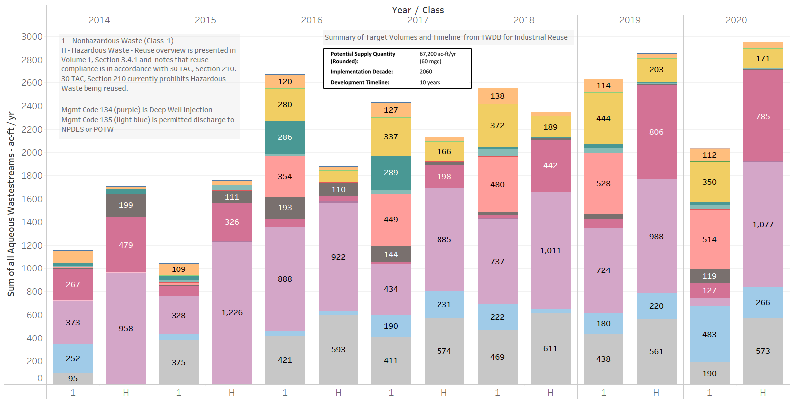 
 

The second chart is another presents the ac-ft/yr generated annually from 2014 - 2020.   The chart is further divided in waste characterizations (Hazardous, Class 1 Nonhazardous) and number of facilities reporting waste generated for the respective class (2nd y-axis).  The main take aways are:

Majority of Hazardous Waste is generated in Brazoria county and majority of Class 1 Nonhazardous Waste is generated in Harris County

Harris county currently has Industrial wastewater being discharged to a local POTW or waters of the state through a NPDES permit

 

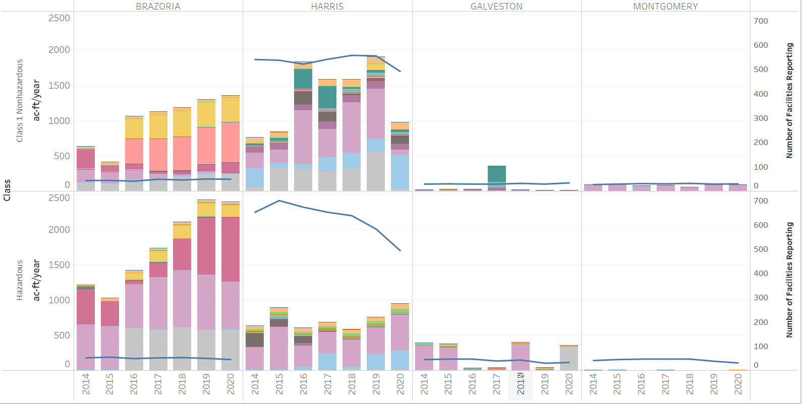 
 
 
The wastewater is currently being generated and in most cases is shipped offsite in a tanker or drums which lends itself to potential reuse opportunities.  The section of the state regulations that regulates, and potential limits, reuse is identified in volume 1, Section 3.4 of the Region H RWP.
  
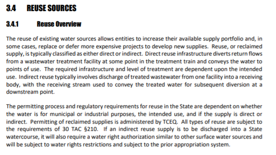  
  
<a href="https://texreg.sos.state.tx.us/public/readtac$ext.TacPage?sl=T&app=9&p_dir=P&p_rloc=98217&p_tloc=&p_ploc=1&pg=7&p_tac=&ti=30&pt=1&ch=210&rl=53">30 TAC 210.54</a> identifies waste which are not considered elgible for coverage under the reuse regulations. There are opportunities for treatment would could move some of these wastes into the candidate category and those opportunities should be explored. 
 
 

Link to TWDB plans.  Scroll down to Region H for access to Volume 1 and 2. : <a href="https://www.twdb.texas.gov/waterplanning/rwp/plans/2021/">Region H Plan</a>

 

Backup information

Introduction of the Region H regional plan, Volume 1

 
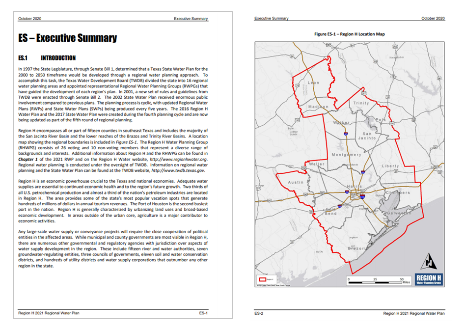 

Estimate of water usage increase in upcoming decades, Volume 1

 
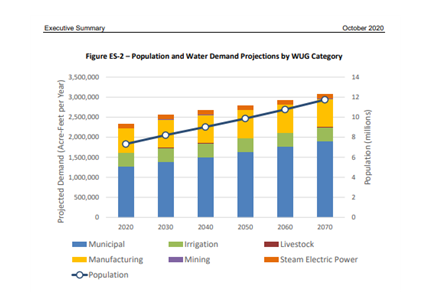 

Introduction of Wastewater Reuse Plan, Volume 2

 
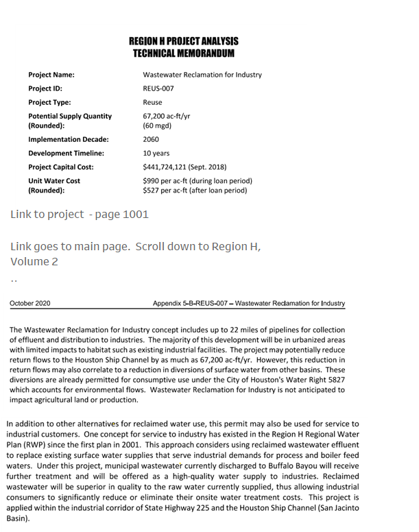 

High level view of treatment, Volume 2

 
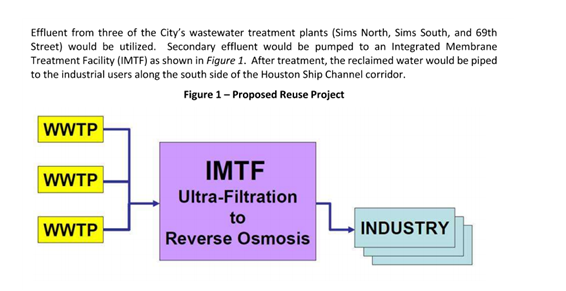 

Proposed wastewater reuse distribution map

 
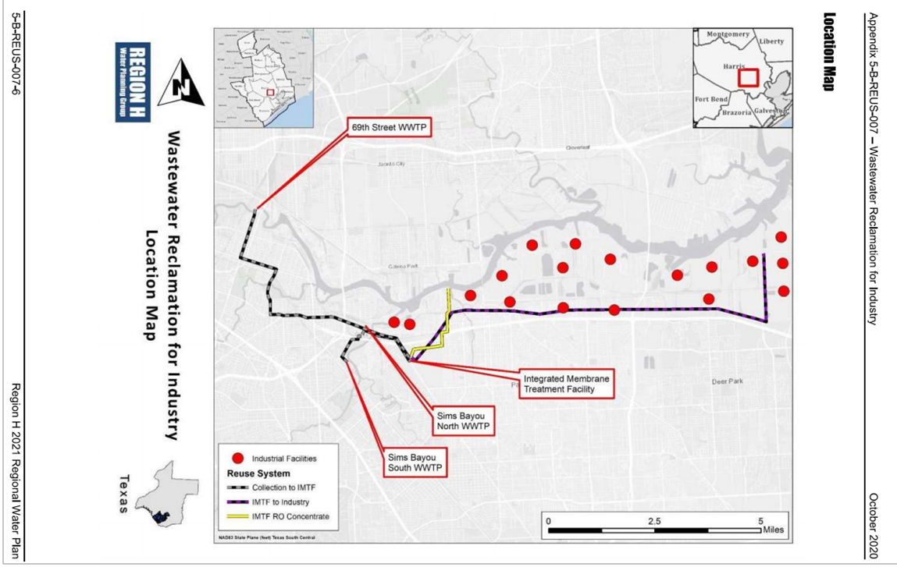 

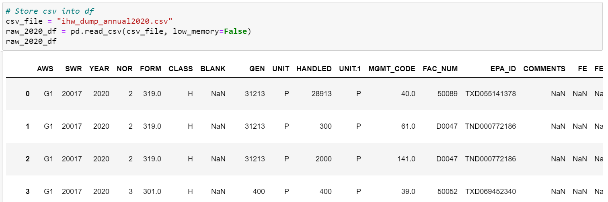 

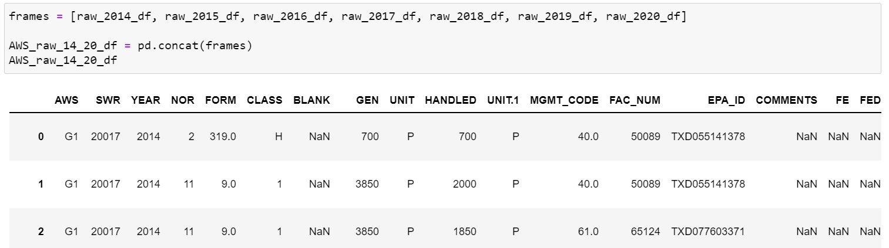 

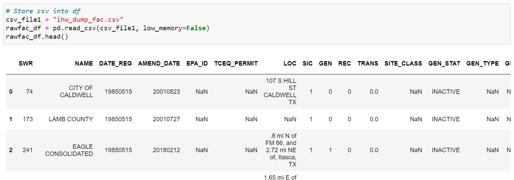 

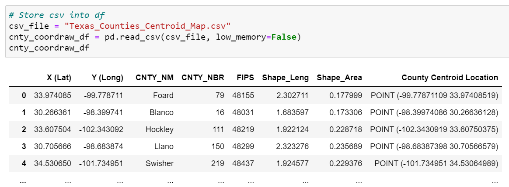 

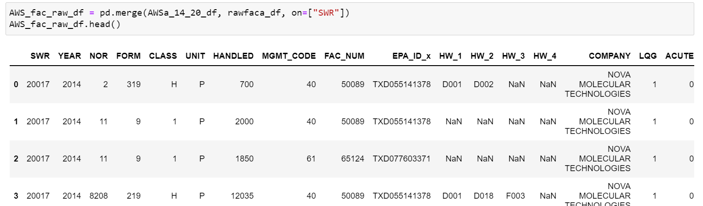 

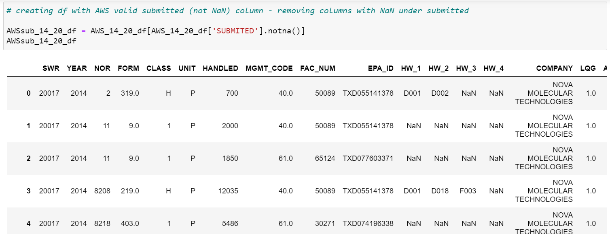 

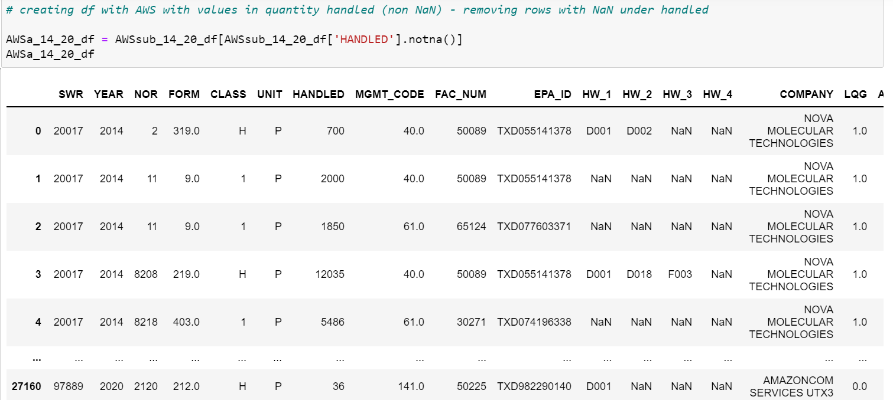 

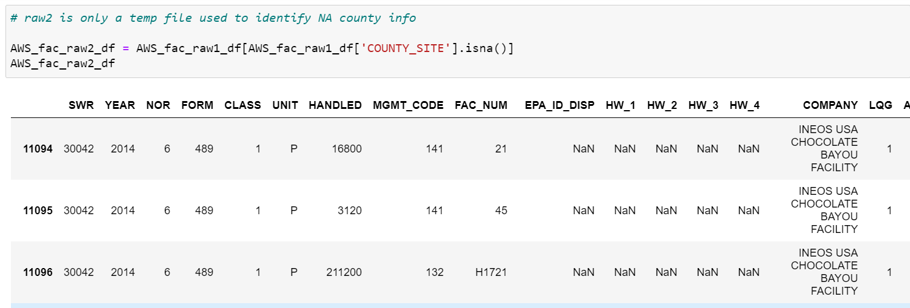 

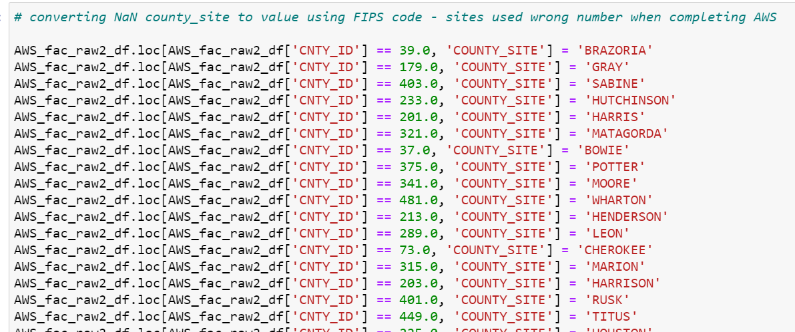 

